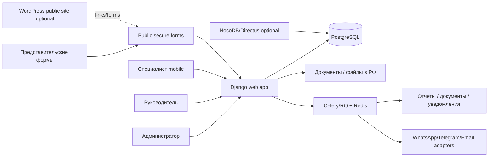

# Исследование стека и архитектуры

Дата: 2026-05-13

## Рекомендация

Для срочного, но устойчивого запуска рекомендую:

- PostgreSQL как единственный источник истины;
- Django 6 + PostgreSQL для бэкенда, доменной логики, админки, форм, прав и отчетов;
- Django Admin только для справочников и внутренних CRUD, не как единственный интерфейс;
- кастомные Django views + HTMX/Alpine для быстрых процессных экранов;
- React/FullCalendar как отдельный интерактивный компонент расписания, если обычных серверных экранов станет мало;
- Celery/RQ + Redis для фоновых задач: уведомления, генерация документов, отчеты, ночные сверки;
- S3-совместимое хранилище в РФ или локальное файловое хранилище для документов, с шифрованием и разграничением доступа;
- WordPress оставить только для публичного сайта, если он нужен;
- NocoDB оставить как временный прототип/табличный интерфейс для ограниченного круга администраторов, но не как ядро бизнес-логики.

После уточнения от 2026-05-14 рекомендация становится рабочим решением для MVP: `Django + PostgreSQL`, локальное развертывание, без WordPress в первой версии.

Причина с точки зрения AI-assisted разработки: Django навязывает понятную структуру проекта, стандартные модели/миграции/forms/admin/auth/tests и хорошо документированные паттерны. Это уменьшает количество архитектурных решений, которые ИИ должен угадывать. WordPress-плагин или no-code-связка WP + NocoDB быстрее для простой витрины, но хуже для сложной доменной логики, тестируемости и долгосрочного сопровождения.

## Почему не WP + NocoDB как ядро

WP + NocoDB может быстро дать сайт, таблицы, формы, REST API и no-code представления. Это полезно для прототипа.

Но проект требует:

- запрета пересечений расписания на уровне данных;
- транзакционного списания балансов;
- истории переносов, отмен, неявок и корректировок;
- сложного RBAC по ролям центра;
- отчетов по грантам и фондам;
- защищенного контура ПДн и документов.

NocoDB официально описывает себя как no-code database platform со spreadsheet-интерфейсом, разными view, REST API, webhooks, scripting и access control. Но в текущей документации важные возможности для этого проекта имеют ограничения: table permissions доступны с Cloud Plus / self-hosted Enterprise, record-level security доступна в Enterprise, часть webhook-trigger возможностей и scripts также привязаны к платным планам. Источники: https://nocodb.com/docs/product-docs, https://nocodb.com/docs/product-docs/roles-and-permissions/table-permissions, https://nocodb.com/docs/product-docs/roles-and-permissions/record-level-security, https://nocodb.com/docs/product-docs/automation/webhook/create-webhook.

WordPress REST API ориентирован на сайт/content и позволяет делать custom endpoints, но тогда ядро придется писать как WordPress plugin/PHP-приложение. Это добавит зависимость от CMS, плагинов и модели ролей WordPress. WordPress сам описывает REST API как интерфейс к данным сайта и контенту, а роли по умолчанию завязаны на задачи сайта: posts, pages, media, comments. Источники: https://developer.wordpress.org/rest-api/, https://developer.wordpress.org/rest-api/extending-the-rest-api/adding-custom-endpoints/, https://wordpress.org/documentation/article/roles-and-capabilities/.

Вывод: WP + NocoDB можно использовать как временную оболочку или публичный сайт, но не как фундамент операционной системы центра.

## Почему PostgreSQL обязателен

Расписание - это задача с пересечениями временных интервалов. PostgreSQL имеет range types и exclusion constraints, которые позволяют не только показать конфликт в UI, но и запретить конфликтную запись в базе. Это критично, потому что два администратора или автоматизация могут записать одно и то же время одновременно.

Официальная документация PostgreSQL описывает exclusion constraints для non-overlapping range values и пример с запретом пересечения бронирований комнаты. Источник: https://www.postgresql.org/docs/current/rangetypes.html.

Практическая модель:

- `appointment.timespan` как `tstzrange` или расчетный диапазон из `starts_at` + `ends_at`;
- exclusion constraint по `(child_id, timespan)` для активных статусов;
- exclusion constraint по `(staff_id, timespan)` для активных статусов;
- exclusion constraint по `(room_id, timespan)` для активных статусов, если комната задана;
- отмененные/черновые/архивные статусы исключаются через условие.

## Почему Django подходит лучше всего для срочного MVP

Django дает быстрый старт для back-office:

- встроенный admin читает metadata моделей и быстро дает внутренний интерфейс для trusted users;
- официальная документация прямо предупреждает: если нужен process-centric interface, надо писать собственные views, что как раз подходит для расписания;
- встроенные пользователи, группы и default permissions дают основу ролей;
- Django forms покрывают подготовку, отображение, валидацию и обработку форм;
- Django поддерживает PostgreSQL ExclusionConstraint.

Источники: https://docs.djangoproject.com/en/6.0/ref/contrib/admin/, https://docs.djangoproject.com/en/6.0/topics/auth/default/, https://docs.djangoproject.com/en/6.0/topics/forms/, https://docs.djangoproject.com/en/6.0/ref/contrib/postgres/constraints/.

Это снижает количество движущихся частей. На первом этапе можно сделать не красивую SPA, а надежные рабочие экраны, которые администратор реально использует.

## Альтернативы

### Directus + PostgreSQL

Directus сильнее NocoDB как headless data platform: динамические REST/GraphQL API, permissions, flows. Источники: https://docs.directus.io/reference/introduction, https://directus.io/docs/api/permissions, https://docs.directus.io/reference/system/flows.

Подходит как внутренний data studio поверх PostgreSQL. Но для конфликтов расписания, ledger-финансов и переносов все равно нужен доменный сервис. Если сотрудники редактируют критические таблицы напрямую, правила нужно жестко страховать в PostgreSQL.

Вердикт: хорошая альтернатива NocoDB для админского слоя, но не замена доменной логике.

### Supabase + Next.js

Supabase удобен для Auth, Storage, Realtime и Postgres RLS. Он официально поддерживает self-hosting для полного контроля над данными и compliance, но в self-hosting оператор сам отвечает за серверы, security hardening, Postgres maintenance, backups, monitoring и uptime. Источники: https://supabase.com/docs/guides/self-hosting, https://supabase.com/docs/guides/database/postgres/row-level-security.

Для команды без сильного DevOps это может быть больше инфраструктуры, чем нужно. Supabase Studio также не заменяет процессный интерфейс администратора.

Вердикт: рассматривать позже для realtime/порталов, но не как самый быстрый путь к MVP.

### Next.js/NestJS/Prisma

Хороший TypeScript-стек для полноценного продукта, особенно если цель - масштабируемая SaaS-платформа. Но для срочного back-office придется с нуля делать админку, формы, роли, CRUD и отчеты. Это может быть оправдано, если главный разработчик сильнее в TypeScript, чем в Python/Django.

Вердикт: технически возможно, но не самый короткий путь при текущих вводных.

## Архитектурный контур

## Персональные данные и хостинг

Это не юридическое заключение, но техническое решение должно исходить из того, что система обрабатывает ПДн получателей, родителей, договорные данные, медицинские рекомендации и фото/видео.

ФЗ-152 требует при сборе ПДн граждан РФ не использовать базы за пределами РФ для записи, систематизации, накопления, хранения, уточнения и извлечения, кроме установленных исключений. Источник: https://www.consultant.ru/document/cons_doc_LAW_61801/cbf4e15b7c330f9372e876cdf2bc928bad7950ef/.

Практическая рекомендация:

- production-хостинг и backups только в РФ или локально в центре;
- отдельные роли доступа к паспортным данным и медицинским документам;
- журнал доступа к ПДн;
- хранить минимум сканов паспортов, если достаточно структурных данных для договора;
- передавать документы через защищенную форму, а не через WhatsApp/Telegram;
- в мессенджеры отправлять только неперсонализированные или минимизированные сообщения, пока юрист не подтвердит допустимость формулировок.

## ADR-кандидаты

1. ADR-001: PostgreSQL как источник истины.
2. ADR-002: Django как backend и first admin interface.
3. ADR-003: NocoDB не является системой записи для критичной логики.
4. ADR-004: Ledger-модель для балансов вместо изменяемых счетчиков.
5. ADR-005: Документы и ПДн хранятся в отдельном защищенном контуре.
